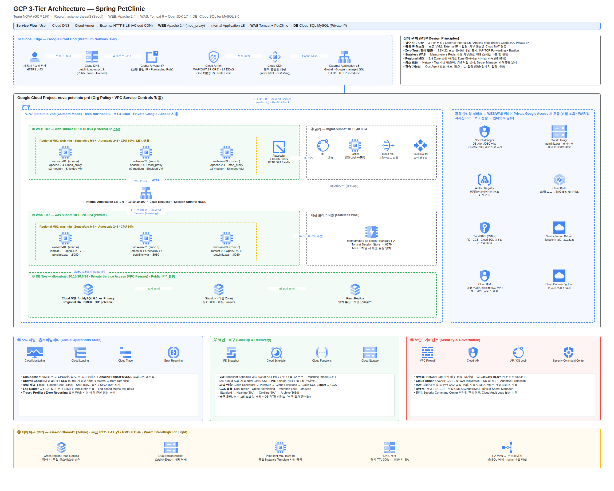

# AI_Cloud_project — GCP 3-Tier PetClinic

베스핀글로벌 KDT 멀티클라우드 중간프로젝트 **GCP 1팀 (NOVA)**
Google Cloud Platform 에 Spring PetClinic 을 3-Tier(WEB / WAS / DB)로 구축하기 위한 아키텍처 설계 저장소.

```
User → Cloud DNS → Cloud Armor → External HTTPS LB (+CDN)
     → WEB (Apache 2.4, mod_proxy) → Internal Application LB
     → WAS (Tomcat 9 + OpenJDK 17 + petclinic.war)
     → Cloud SQL for MySQL 8.0 (Private IP)
```

## 저장소 구성

| 경로 | 내용 |
|---|---|
| [`architecture/gcp-3tier-petclinic-architecture.drawio`](architecture/gcp-3tier-petclinic-architecture.drawio) | **draw.io 아키텍처 (4페이지)** — 공식 GCP 아이콘 사용 |
| [`architecture/preview/`](architecture/preview) | 각 페이지 PNG 미리보기 |
| [`architecture/tools/`](architecture/tools) | 다이어그램 생성 스크립트 (재생성·수정용) |
| [`docs/architecture-guide.md`](docs/architecture-guide.md) | **설계서** — 요구사항 매핑 · 서비스 선정 근거 · 백업/모니터링/보안 정책 · Q&A 대비 |

## 다이어그램 페이지

| 페이지 | 내용 |
|---|---|
| ① 전체 아키텍처 | 3-Tier 전체 흐름 + 모니터링 · 백업 · 보안 · DR 요약 |
| ② 모니터링 · 로깅 상세 | 수집(Ops Agent) → 분석 → 판단(SLO) → 전달(알림) 파이프라인 |
| ③ 백업 · 재해복구(DR) 상세 | VM/DB/파일 백업 경로, GCS 수명주기, RPO/RTO 표 |
| ④ 보안 · 네트워크 상세 | 5계층 방어, 방화벽 규칙표, 관리자 접근 경로(Zero Trust) |



## 여는 방법

[app.diagrams.net](https://app.diagrams.net) → **File → Open From → Device** 에서 `.drawio` 파일을 연다.
아이콘은 draw.io 에 내장된 **공식 Google Cloud 제품 아이콘(SVG)** 을 인라인으로 포함했으므로
별도 라이브러리 설치나 네트워크 연결이 필요 없다.

## 다이어그램 재생성

```bash
cd architecture/tools
python3 gen.py                                            # .drawio 재생성
python3 preview.py ../gcp-3tier-petclinic-architecture.drawio ./prev   # HTML 미리보기 생성
```

레이아웃은 `p1.py` ~ `p4.py` 에서 좌표로 정의된다. `lib.py` 의 `Page.icon()` 은
`gcpicons.json` (draw.io 의 공식 GCP 아이콘 121종)에서 아이콘을 찾아 배치한다.

> `preview.py` 가 만드는 PNG 는 검수용 **근사 렌더링**이다.
> 도형·아이콘 위치는 실제와 같지만 간선 경로와 라벨 위치는 draw.io 의 라우터와 다를 수 있다.
> 최종 산출물은 항상 `.drawio` 파일을 기준으로 한다.
